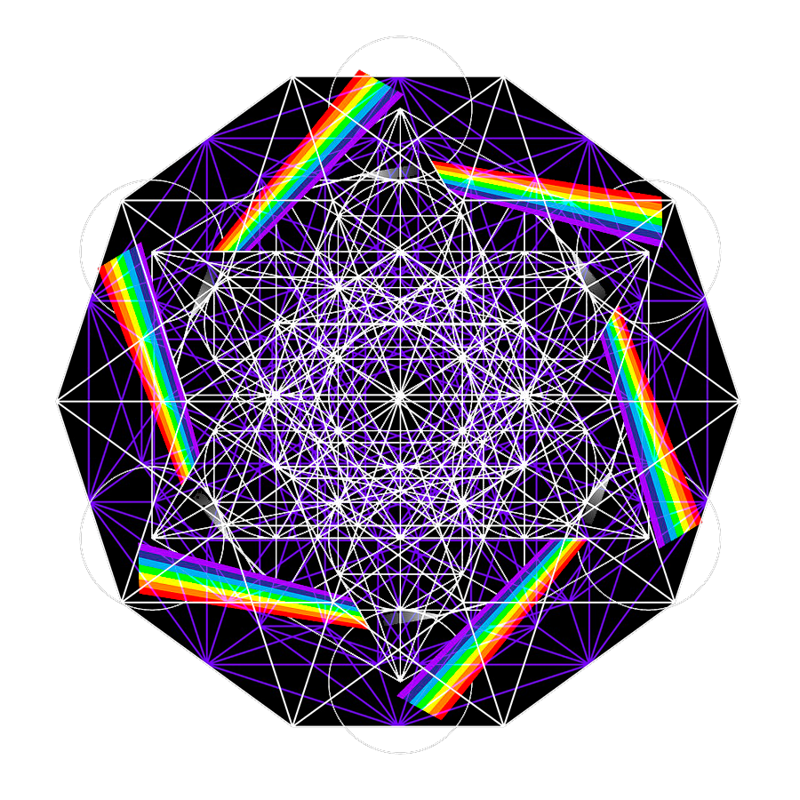

# Dessor
n-Dimensional Euclidean Space Simulator OpenGL Renderer and "fractal dimension"

  <a href="https://github.com/acalasanzs/dessor/contributors">
    
  <a/>
  <a href="https://github.com/acalasanzs/dessor/network/members">
    
  <a/>
  <a href="https://github.com/acalasanzs/dessor/stargazers">
    
  <a/>
  <a href="https://github.com/acalasanzs/dessor/issues">
    
  <a/>
  <a href="https://github.com/acalasanzs/dessor/blob/main/LICENSE">
    
  <a/>

<!-- PROJECT LOGO -->
 

  

  <h3 align="center">n-Dimensional Euclidean Space Simulator OpenGL Renderer and "fractal dimension"</h3>

  

    A project to render any shape of any dimension including fractals
     
    <a href="https://github.com/acalasanzs/dessor"><strong>Explore »</strong></a>
     
     
    <a href="https://github.com/acalasanzs/dessor/blob/fixed/x64/Debug/Dessor.exe">View Demo</a>
    ·
    <a href="https://github.com/acalasanzs/dessor/issues">Report Bug</a>
    ·
    <a href="https://github.com/acalasanzs/dessor/issues">Request Feature</a>
  

    

